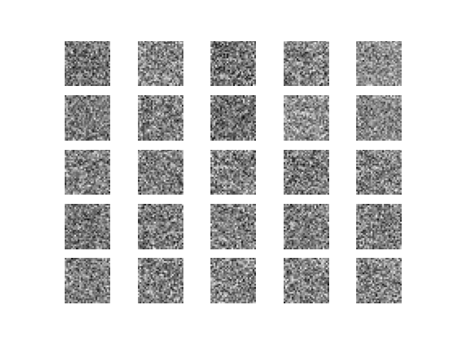
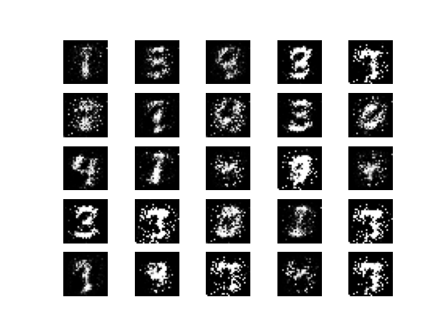
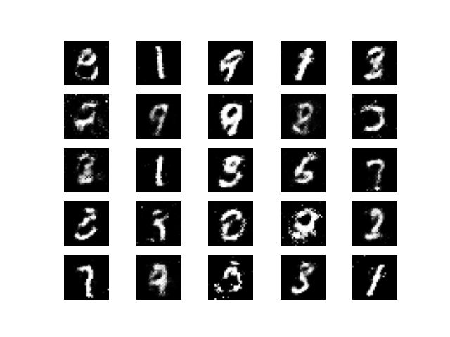

# GAN으로 생성한 숫자 손글씨 (MNIST)

GAN을 사용해서 손글씨 숫자 데이터를 생성한다. 반복 횟수를 늘릴수록 그럴듯한 이미지가 생성되는 것을 확인할 수 있다.

### 시작

사실상 랜덤하게 생성된 노이즈에 불과하다

### 100000회 반복

숫자의 형태가 보이기 시작한다. 하지만 아직 Discriminator가 가짜 이미지와 진짜 이미지를 잘 구분한다. (metric 상으로 accuracy가 상당히 높음)

### 298000회 반복

생성된 숫자가 선명해지기 시작한다. 여전히 Discriminator가 진짜 이미지와 가짜 이미지를 잘 구분하는 편이지만, 약 70%의 정확률로 떨어졌다. 최적의 조건을 아니더라도 상당한 수준까지 Generator가 데이터를 잘 생성하는 것을 정성적으로 확인할 수 있다.